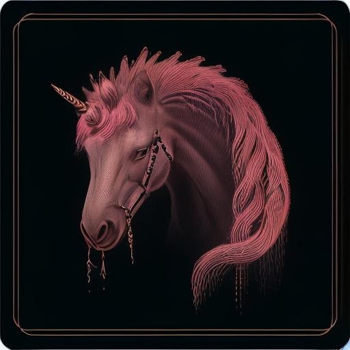

# OpenVINO Latent Consistency Model C++ Image Generation Pipeline

The pure C++ text-to-image pipeline, driven by the OpenVINO native API for SD v1.5 Latent Consistency Model with LCM Scheduler. It includes advanced features like [LoRA](https://huggingface.co/docs/peft/main/en/conceptual_guides/lora#lora) integration with [safetensors](https://huggingface.co/docs/safetensors/index#format) and [OpenVINO Tokenizers](https://github.com/openvinotoolkit/openvino_tokenizers). Loading `openvino_tokenizers` to `ov::Core` enables tokenization. [The common folder](../../common/) contains schedulers for image generation and `imwrite()` for saving `bmp` images. This demo has been tested for Linux platform only. There is also a Jupyter [notebook](https://github.com/openvinotoolkit/openvino_notebooks/blob/latest/notebooks/latent-consistency-models-image-generation/lcm-lora-controlnet.ipynb) which provides an example of image generaztion in Python.

> [!NOTE]
> This tutorial assumes that the current working directory is `<openvino.genai repo>/image_generation/lcm_dreamshaper_v7/cpp/` and all paths are relative to this folder.

## Step 1: Prepare Build Environment

Prerequisites:
- Conda ([installation guide](https://conda.io/projects/conda/en/latest/user-guide/install/index.html))

C++ Packages:
* [CMake](https://cmake.org/download/): Cross-platform build tool
* [OpenVINO](https://docs.openvino.ai/2024/get-started/install-openvino.html): Model inference

Prepare a python environment and install dependencies:

```shell
conda create -n openvino_lcm_cpp python==3.10
conda activate openvino_lcm_cpp
conda update -c conda-forge --all
conda install -c conda-forge openvino=2024.2.0 c-compiler cxx-compiler git make cmake
# Ensure that Conda standard libraries are used
conda env config vars set LD_LIBRARY_PATH=$CONDA_PREFIX/lib:$LD_LIBRARY_PATH
```

## Step 2: Obtain Latent Consistency Model

1. Install dependencies to import models from HuggingFace:

    ```shell
    git submodule update --init
    conda activate openvino_lcm_cpp
    python -m pip install -r ../../requirements.txt
    python -m pip install ../../../thirdparty/openvino_tokenizers/[transformers]
    ```

2. Download the model from Huggingface and convert it to OpenVINO IR via [optimum-intel CLI](https://github.com/huggingface/optimum-intel). 

    Example command for downloading [SimianLuo/LCM_Dreamshaper_v7](https://huggingface.co/SimianLuo/LCM_Dreamshaper_v7) model and exporting it with FP16 precision:

    `optimum-cli export openvino --model SimianLuo/LCM_Dreamshaper_v7 --weight-format fp16 models/lcm_dreamshaper_v7/FP16`

    You can also choose other precision and export FP32 or INT8 model.

    Please, refer to the official website for [🤗 Optimum](https://huggingface.co/docs/optimum/main/en/index) and [optimum-intel](https://github.com/huggingface/optimum-intel) to read more details.

    If https://huggingface.co/ is down, the script won't be able to download the model.

### (Optional) Enable LoRA Weights with Safetensors

Low-Rank Adaptation (LoRA) is a technique introduced to deal with the problem of fine-tuning Diffusers and Large Language Models (LLMs). In the case of Stable Diffusion fine-tuning, LoRA can be applied to the cross-attention layers for the image representations with the latent described.

LoRA weights can be enabled for Unet model of Stable Diffusion pipeline to generate images with different styles.

In this sample LoRA weights are used in [safetensors]((https://huggingface.co/docs/safetensors/index#format)) format.
Safetensors is a serialization format developed by Hugging Face that is specifically designed for efficiently storing and loading large tensors. It provides a lightweight and efficient way to serialize tensors, making it easier to store and load machine learning models.

The LoRA safetensors model is loaded via [safetensors.h](https://github.com/hsnyder/safetensors.h). The layer name and weight are modified with `Eigen` library and inserted into the SD models with `ov::pass::MatcherPass` in the file [common/diffusers/src/lora.cpp](https://github.com/openvinotoolkit/openvino.genai/blob/master/image_generation/common/diffusers/src/lora.cpp).

There are various LoRA models on https://civitai.com/tag/lora and on HuggingFace, you can consider to choose your own LoRA model in safetensor format. For example, you can use LoRA [soulcard model](https://civitai.com/models/67927?modelVersionId=72591).
Download and put LoRA safetensors model into the models directory. When running the built sample provide the path to the LoRA model with `-l, --loraPath arg` argument.

## Step 3: Build the LCM Application

```shell
conda activate openvino_lcm_cpp
cmake -DCMAKE_BUILD_TYPE=Release -S . -B build
cmake --build build --config Release --parallel
```

## Step 4: Run Pipeline
```shell
./build/lcm_dreamshaper [-p <posPrompt>] [-s <seed>] [--height <output image>] [--width <output image>] [-d <device>] [-r <readNPLatent>] [-a <alpha>] [-h <help>] [-m <modelPath>] [-t <modelType>] [--guidanceScale <guidanceScale>] [--dynamic]

Usage:
  lcm_dreamshaper [OPTION...]
```

* `-p, --posPrompt arg` Initial positive prompt for LCM (default: "a beautiful pink unicorn")
* `-d, --device arg`    AUTO, CPU, or GPU. Doesn't apply to Tokenizer model, OpenVINO Tokenizers can be inferred on a CPU device only (default: CPU)
* `--step arg`          Number of diffusion step (default: 4)
* `-s, --seed arg`      Number of random seed to generate latent (default: 42)
* `--guidanceScale arg` A higher guidance scale value encourages the model to generate images closely linked to the text prompt at the expense of lower image quality (default: 8.0)
* `--num arg`           Number of image output (default: 1)
* `--height arg`        Height of output image (default: 512)
* `--width arg`         Width of output image (default: 512)
* `-c, --useCache`      Use model caching
* `-r, --readNPLatent`  Read numpy generated latents from file, only supported for one output image
* `-m, --modelPath arg` Specify path to LCM model IRs (default: ./models/lcm_dreamshaper_v7)
* `-t, --type arg`      Specify the type of LCM model IRs (e.g., FP32, FP16 or INT8) (default: FP16)
* `--dynamic`           Specify the model input shape to use dynamic shape
* `-l, --loraPath arg`  Specify path to LoRA file (*.safetensors) (default: )
* `-a, --alpha arg`     Specify alpha for LoRA (default: 0.75)
* `-h, --help`          Print usage

> [!NOTE]
> The tokenizer model will always be loaded to CPU: [OpenVINO Tokenizers](https://github.com/openvinotoolkit/openvino_tokenizers) can be inferred on a CPU device only.

Example:

Positive prompt: a beautiful pink unicorn

To read the numpy latent input and noise for scheduler instead of C++ std lib for the alignment with Python pipeline, use `-r, --readNPLatent` argument.

* Generate image with random data generated by Python: `./build/lcm_dreamshaper -r`


* Generate image with C++ lib generated latent and noise: `./build/lcm_dreamshaper`


* Generate image with soulcard lora and C++ generated latent and noise: `./build/lcm_dreamshaper -l path/to/soulcard.safetensors`



## Benchmark:

For the generation quality, C++ random generation with MT19937 results differ from `numpy.random.randn()` and `diffusers.utils.randn_tensor`. Hence, please use `-r, --readNPLatent` for the alignment with Python (this latent file is for output image 512X512 only)

## Notes

#### Guidance Scale

Guidance scale controls how similar the generated image will be to the prompt. A higher guidance scale means the model will try to generate an image that follows the prompt more strictly. A lower guidance scale means the model will have more creativity.
`guidance_scale` is a way to increase the adherence to the conditional signal that guides the generation (text, in this case) as well as overall sample quality. It is also known as [classifier-free guidance](https://arxiv.org/abs/2207.12598).

#### Negative Prompt

Negative prompts don't work with LCM because they don’t have any effect on the denoising process.
When a LCM is distilled from an LDM via latent consistency distillation (Algorithm 1) with guided distillation, the forward pass of the LCM learns to approximate sampling from the LDM using CFG with the unconditional prompt "" (the empty string). 
Due to this, LCMs currently do not support negative prompts.

#### LoRA Weights Enabling

Refer to the [OpenVINO blog](https://blog.openvino.ai/blog-posts/enable-lora-weights-with-stable-diffusion-controlnet-pipeline) to get more information on enabling LoRA weights.
