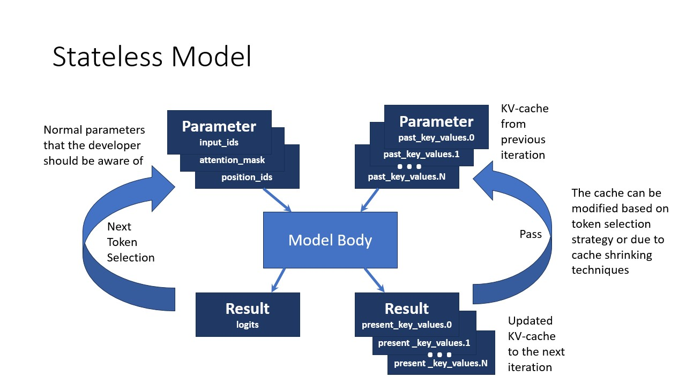

# OpenVINO Generate API

## Usage 

First of all you need to convert your model with optimum-cli
``` sh
optimum-cli export openvino --model "TinyLlama/TinyLlama-1.1B-Chat-v1.0" --trust-remote-code "TinyLlama-1.1B-Chat-v1.0"
pip install openvino-genai
```

`LLMPipeline` is the main object used for decoding. You can construct it straight away from the folder with the converted model. It will automatically load the main model, tokenizer, detokenizer and default generation configuration.

### Python

A minimalist example:
```python
import openvino_genai as ov_genai
pipe = ov_genai.LLMPipeline(model_path, "CPU")
print(pipe.generate("The Sun is yellow bacause"))
```

Calling generate with custom generation config parameters, e.g. config for grouped beam search
```python
import openvino_genai as ov_genai
pipe = ov_genai.LLMPipeline(model_path, "CPU")

result = pipe.generate("The Sun is yellow bacause", max_new_tokens=30, num_groups=3, group_size=5, diversity_penalty=1.5)
print(result)
```

output:
```
'it is made up of carbon atoms. The carbon atoms are arranged in a linear pattern, which gives the yellow color. The arrangement of carbon atoms in'
```

A simples chat in python:
```python
import openvino_genai as ov_genai
pipe = ov_genai.LLMPipeline(model_path)

config = {'num_groups': 3, 'group_size': 5, 'diversity_penalty': 1.5}
pipe.set_generation_config(config)

pipe.start_chat()
while True:
    print('question:')
    prompt = input()
    if prompt == 'Stop!':
        break
    print(pipe(prompt))
pipe.finish_chat()
```

Test to compare with Huggingface outputs

### C++

Minimalistc example
```cpp
#include "openvino/genai/llm_pipeline.hpp"
#include <iostream>

int main(int argc, char* argv[]) {
    std::string model_path = argv[1];
    ov::genai::LLMPipeline pipe(model_path, "CPU");
    std::cout << pipe.generate("The Sun is yellow bacause");
}
```

Using Group Beam Search Decoding
```cpp
#include "openvino/genai/llm_pipeline.hpp"
#include <iostream>

int main(int argc, char* argv[]) {
    std::string model_path = argv[1];
    ov::genai::LLMPipeline pipe(model_path, "CPU");

    ov::genai::GenerationConfig config = pipe.get_generation_config();
    config.max_new_tokens = 256;
    config.num_groups = 3;
    config.group_size = 5;
    config.diversity_penalty = 1.0f;

    std::cout << pipe.generate("The Sun is yellow bacause", config);
}
```

A simple chat in C++ using grouped beam search decoding
``` cpp
#include "openvino/genai/llm_pipeline.hpp"
#include <iostream>

int main(int argc, char* argv[]) {
    std::string prompt;

    std::string model_path = argv[1];
    ov::genai::LLMPipeline pipe(model_path, "CPU");
    
    ov::genai::GenerationConfig config = pipe.get_generation_config();
    config.max_new_tokens = 256;
    config.num_groups = 3;
    config.group_size = 5;
    config.diversity_penalty = 1.0f;
    
    pipe.start_chat();
    for (;;;) {
        std::cout << "question:\n";
        std::getline(std::cin, prompt);
        if (prompt == "Stop!")
            break;

        std::cout << "answer:\n";
        auto answer = pipe(prompt, config);
        std::cout << answer << std::endl;
    }
    pipe.finish_chat();
}
```

Streaming example with lambda function
``` cpp
#include "openvino/genai/llm_pipeline.hpp"
#include <iostream>

int main(int argc, char* argv[]) {
    std::string model_path = argv[1];
    ov::genai::LLMPipeline pipe(model_path, "CPU");
        
    auto streamer = [](std::string word) { std::cout << word << std::flush; };
    std::cout << pipe.generate("The Sun is yellow bacause", streamer);
}
```

Streaming with a custom class
``` cpp
#include "openvino/genai/streamer_base.hpp"
#include "openvino/genai/llm_pipeline.hpp"
#include <iostream>

class CustomStreamer: public ov::genai::StreamerBase {
public:
    bool put(int64_t token) {
        bool stop_flag = false;
        /* custom decoding/tokens processing code
        tokens_cache.push_back(token);
        std::string text = m_tokenizer.decode(tokens_cache);
        ...
        */
        return stop_flag;
    };

    void end() {
        /* custom finalization */
    };
};

int main(int argc, char* argv[]) {
    CustomStreamer custom_streamer;

    std::string model_path = argv[1];
    ov::genai::LLMPipeline pipe(model_path, "CPU");
    std::cout << pipe.generate("The Sun is yellow bacause", custom_streamer);
}
```

## How it works

### Stateful LLM

A common LLM inference optimisation is introduction of past KV (key/value)-cache. This cache is represented by the corresponding inputs and outputs in a model implemented originally in DL framework (e.g. PyTorch models from HuggingFace). To optimize it further and simplify usage, the model is transformed to a stateful form. This transformation improves inference performance and decreases amount of allocated runtime memory in long running text generation scenarios. It is achieved by hiding inputs and outputs of the model that represent past KV-cache tensors and handling them inside the model in a more efficient way. Although the cache is still accessible with state API. It is opposed to stateless model approach requiring manipulating these inputs and outputs explicitly. An introduction to stateful models can be found in https://docs.openvino.ai/2023.3/openvino_docs_OV_UG_stateful_models_intro.html.

Hiding KV-cache introduces a peculiarity for beam search algorithm. Beam search suggests batched inference of multiple beams. The design described here so far would result in generating multiple independent sequences of tokens. Beam search algorithm, on the other hand, requires removing some of the ongoing beams and splitting other beams to multiple branches. Beam removal requires deleting corresponding KV-cache entry and beam splitting requires copying corresponding KV-cache values.

To provide the possibility to implement beam search without accessing model's internal state, a stateful LLM converted with `optimum-intel` or [llm_bench](../../../llm_bench/python/) introduces an additional 1-dimentional `beam_idx` input. `beam_idx` must contain indexes of elements in a batch which are intended to be selected and will evolve during the next beam search iteration. There's only one beam when the generation starts. That beam corresponds to the initial prompt. `beam_idx` must have values: `[0, 0]` to keep the initial beam and introduce its copy. The dynamic batch size enables to change the number of beams dynamically. `beam_idx` must have `[1]` as the value to remove zeroth sequence and keep the second beam only.

Assume there are two running beams. To proceed with generating both beams at the next iteration, `beam_idx` values must be `[0, 1]`, pointing to batch elements `0` and `1`. To drop the last beam and split the other beam in two, `beam_idx` must be set to `[0, 0]`. This results in utilizing only the part of KV cache corresponding to the zeroth element in the batch. The process of selecting proper entries in cache is called Cache Reorder.


The images below represent stateless and stateful LLM pipelines. The model has 4 inputs:
1. `input_ids` contains the next selected token
2. `attention_mask` is filled with `1`
3. `position_ids` encodes a position of currently generating token in the sequence
4. `beam_idx` selects beams

The model has 1 output `logits` describing the predicted distribution over the next tokens. And there's KV cache state.




## Supported models

1. chatglm
   1. https://huggingface.co/THUDM/chatglm2-6b - refer to
   [chatglm2-6b - AttributeError: can't set attribute](../../../llm_bench/python/doc/NOTES.md#chatglm2-6b---attributeerror-cant-set-attribute)
   in case of `AttributeError`
   2. https://huggingface.co/THUDM/chatglm3-6b
2. LLaMA 2 (requires access request submission on its Hugging Face page to be downloaded)
   1. https://huggingface.co/meta-llama/Llama-2-13b-chat-hf
   2. https://huggingface.co/meta-llama/Llama-2-13b-hf
   3. https://huggingface.co/meta-llama/Llama-2-7b-chat-hf
   4. https://huggingface.co/meta-llama/Llama-2-7b-hf
   5. https://huggingface.co/meta-llama/Llama-2-70b-chat-hf
   6. https://huggingface.co/meta-llama/Llama-2-70b-hf
3. [Llama2-7b-WhoIsHarryPotter](https://huggingface.co/microsoft/Llama2-7b-WhoIsHarryPotter)
4. OpenLLaMA
   1. https://huggingface.co/openlm-research/open_llama_13b
   2. https://huggingface.co/openlm-research/open_llama_3b
   3. https://huggingface.co/openlm-research/open_llama_3b_v2
   4. https://huggingface.co/openlm-research/open_llama_7b
   5. https://huggingface.co/openlm-research/open_llama_7b_v2
5. [TinyLlama](https://huggingface.co/TinyLlama/TinyLlama-1.1B-Chat-v1.0)
6. Qwen
   1. https://huggingface.co/Qwen/Qwen-7B-Chat
   2. https://huggingface.co/Qwen/Qwen-7B-Chat-Int4 - refer to
   3. https://huggingface.co/Qwen/Qwen1.5-7B-Chat
   4. https://huggingface.co/Qwen/Qwen1.5-7B-Chat-GPTQ-Int4
   [Qwen-7B-Chat-Int4 - Torch not compiled with CUDA enabled](../../../llm_bench/python/doc/NOTES.md#qwen-7b-chat-int4---torch-not-compiled-with-cuda-enabled)
   in case of `AssertionError`
7. Dolly
   1. https://huggingface.co/databricks/dolly-v2-3b
8. Phi
   1. https://huggingface.co/microsoft/phi-2
   2. https://huggingface.co/microsoft/phi-1_5
9. [notus-7b-v1](https://huggingface.co/argilla/notus-7b-v1)
10. [zephyr-7b-beta](https://huggingface.co/HuggingFaceH4/zephyr-7b-beta)
11. [redpajama-3b-chat](https://huggingface.co/ikala/redpajama-3b-chat)
12. [Mistral-7B-v0.1](https://huggingface.co/mistralai/Mistral-7B-v0.1)
13. [Gemma-2B-it](https://huggingface.co/google/gemma-2b-it)

This pipeline can work with other similar topologies produced by `optimum-intel` with the same model signature. The model is required heve after the conversion the following inputs:
1. `input_ids` contains the tokens
2. `attention_mask` is filled with `1`
3. `beam_idx` selects beams
4. `position_ids` (optional) encodes a position of currently generating token in the sequence

and a single `logits` output.

Some models may require access request submission on their Hugging Face page to be downloaded.

If https://huggingface.co/ is down, the conversion step won't be able to download the models.

> [!NOTE]
> Models should belong to the same family and have same tokenizers.
