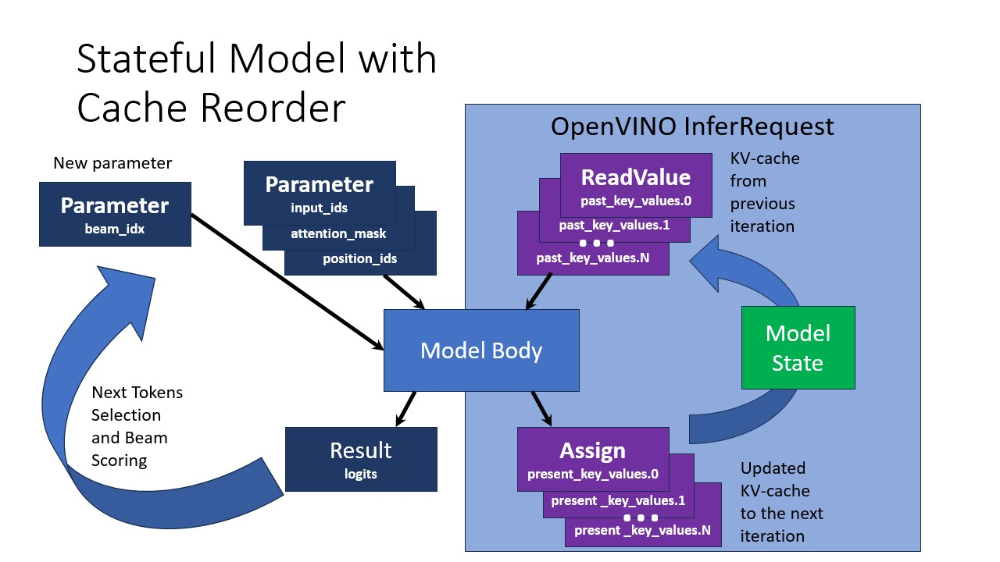

# Text generation C++ samples that support most popular models like LLaMA 2

These examples showcase inference of text-generation Large Language Models (LLMs): `chatglm`, `LLaMA`, `Qwen` and other models with the same signature. The applications don't have many configuration options to encourage the reader to explore and modify the source code. Loading `user_ov_extensions` provided by `openvino-tokenizers` to `ov::Core` enables tokenization. Run `convert_tokenizer` to generate IRs for the samples. [group_beam_searcher.hpp](group_beam_searcher.hpp) implements the algorithm of the same name, which is used by `beam_search_causal_lm`. There is also a Jupyter [notebook](https://github.com/openvinotoolkit/openvino_notebooks/tree/main/notebooks/254-llm-chatbot) which provides an example of LLM-powered Chatbot in Python.

## How it works

### Stateful LLM

A common LLM inference optimisation is introduction of past KV (key/value)-cache. This cache is represented by the corresponding inputs and outputs in a model implemented originally in DL framework (e.g. PyTorch models from HuggingFace). To optimize it further and simplify usage, the model is transformed to a stateful form. This transformation improves inference performance and decreases amount of allocated runtime memory in long running text generation scenarios. It is achieved by hiding inputs and outputs of the model that represent past KV-cache tensors and handling them inside the model in a more efficient way. Although the cache is still accessible with state API. It is opposed to stateless model approach requiring manipulating these inputs and outputs explicitly.

Hiding KV-cache introduces a peculiarity for beam search algorithm. Beam search suggests batched inference of multiple beams. The design described here so far would result in generating multiple independent sequences of tokens. Beam search algorithm, on the other hand, requires removing some of the ongoing beams and splitting other beams to multiple branches. Beam removal requires deleting corresponding KV-cache entry and beam splitting requires copying corresponding KV-cache values.

To provide a possibility to implement beam search without accessing model internal state, a stateful LLM converted with `optimum-intel` or [llm_bench](../../../llm_bench/python/) introduces additional 1-dimentional `beam_idx` input. `beam_idx` must contain indices of elements in a batch which are supposed to be selected and evolve during next beam search iteration. Suppose there are two running beams. To proceed generating both beams at the next iteration, `beam_idx` values must be `[0, 1]`, pointing to batch elements `0` and `1`. To drop the last beam and split the other beam in two, `beam_idx` must be set to `[0, 0]`, this results in utilizing only the part of KV cache corresponding to zeroth element in the batch. The process of selecting appropriate entries in cache is called Cache Reorder.


The images below represent stateless and stateful LLM pipelines. The model has 4 inputs:
1. `input_ids` contains the next selected token
2. `attention_mask` is filled with `1`
3. `position_ids` encodes a position of currently generating token in the sequence
4. `beam_idx` selects beams

The model has 1 output `logits` describing the predicted distribution over the next tokens. And there's KV cache state.




### greedy_causal_lm

The program loads a tokenizer, a detokenizer and a model (`.xml` and `.bin`) to OpenVINO. A prompt is tokenized and passed to the model. The model greedily generates token by token until the special end of sequence (EOS) token is obtained. The predicted tokens are converted to chars and printed in a streaming fashion.

### beam_search_causal_lm

The program loads a tokenizer, a detokenizer and a model (`.xml` and `.bin`) to OpenVINO. A prompt is tokenized and passed to the model. The model predicts a distribution over the next tokens and group beam search samples from that distribution to explore possible sequesnses. The result is converted to chars and printed.

## Install OpenVINO

Install [OpenVINO Archives >= 2023.3](https://docs.openvino.ai/install). `<INSTALL_DIR>` below refers to the extraction location.

## Build `greedy_causal_lm`, `beam_search_causal_lm` and `user_ov_extensions`

### Linux/macOS

```sh
git submodule update --init
source <INSTALL_DIR>/setupvars.sh
cmake -DCMAKE_BUILD_TYPE=Release -S ./ -B ./build/ && cmake --build ./build/ -j
```

### Windows

```bat
git submodule update --init
<INSTALL_DIR>\setupvars.bat
cmake -S .\ -B .\build\ && cmake --build .\build\ --config Release -j
```

### Download and convert the model and tokenizers

The `--upgrade-strategy eager` option is needed to ensure `optimum-intel` is upgraded to the latest version.

#### Linux/macOS

```sh
source <INSTALL_DIR>/setupvars.sh
python3 -m pip install --upgrade-strategy eager "optimum>=1.14" -r ../../../llm_bench/python/requirements.txt ../../../thirdparty/openvino_contrib/modules/custom_operations/[transformers] --extra-index-url https://download.pytorch.org/whl/cpu
python3 ../../../llm_bench/python/convert.py --model_id TinyLlama/TinyLlama-1.1B-Chat-v1.0 --output_dir ./TinyLlama-1.1B-Chat-v1.0/ --precision FP16 --stateful
convert_tokenizer ./TinyLlama-1.1B-Chat-v1.0/pytorch/dldt/FP16/ --output ./TinyLlama-1.1B-Chat-v1.0/pytorch/dldt/FP16/ --with-detokenizer --trust-remote-code
```

#### Windows

```bat
<INSTALL_DIR>\setupvars.bat
python -m pip install --upgrade-strategy eager "optimum>=1.14" -r ..\..\..\llm_bench\python\requirements.txt ..\..\..\thirdparty\openvino_contrib\modules\custom_operations\[transformers] --extra-index-url https://download.pytorch.org/whl/cpu
python ..\..\..\llm_bench\python\convert.py --model_id TinyLlama/TinyLlama-1.1B-Chat-v1.0 --output_dir .\TinyLlama-1.1B-Chat-v1.0\ --precision FP16 --stateful
convert_tokenizer .\TinyLlama-1.1B-Chat-v1.0\pytorch\dldt\FP16\ --output .\TinyLlama-1.1B-Chat-v1.0\pytorch\dldt\FP16\ --with-detokenizer --trust-remote-code
```

## Run

Usage:
1. `greedy_causal_lm <MODEL_DIR> "<PROMPT>"`
2. `beam_search_causal_lm <MODEL_DIR> "<PROMPT>"`

Examples:
1. `./build/greedy_causal_lm ./TinyLlama-1.1B-Chat-v1.0/pytorch/dldt/FP16/ "Why is the Sun yellow?"`
2. `./build/beam_search_causal_lm ./TinyLlama-1.1B-Chat-v1.0/pytorch/dldt/FP16/ "Why is the Sun yellow?"`

To enable Unicode characters for Windows cmd open `Region` settings from `Control panel`. `Administrative`->`Change system locale`->`Beta: Use Unicode UTF-8 for worldwide language support`->`OK`. Reboot.

## Supported models

1. chatglm
   1. https://huggingface.co/THUDM/chatglm2-6b - refer to
   [chatglm2-6b - AttributeError: can't set attribute](../../../llm_bench/python/doc/NOTES.md#chatglm2-6b---attributeerror-cant-set-attribute)
   in case of `AttributeError`
   2. https://huggingface.co/THUDM/chatglm3-6b
2. LLaMA 2
   1. https://huggingface.co/meta-llama/Llama-2-13b-chat-hf
   2. https://huggingface.co/meta-llama/Llama-2-13b-hf
   3. https://huggingface.co/meta-llama/Llama-2-7b-chat-hf
   4. https://huggingface.co/meta-llama/Llama-2-7b-hf
   5. https://huggingface.co/meta-llama/Llama-2-70b-chat-hf
   6. https://huggingface.co/meta-llama/Llama-2-70b-hf
3. [Llama2-7b-WhoIsHarryPotter](https://huggingface.co/microsoft/Llama2-7b-WhoIsHarryPotter)
4. OpenLLaMA
   1. https://huggingface.co/openlm-research/open_llama_13b
   2. https://huggingface.co/openlm-research/open_llama_3b
   3. https://huggingface.co/openlm-research/open_llama_3b_v2
   4. https://huggingface.co/openlm-research/open_llama_7b
   5. https://huggingface.co/openlm-research/open_llama_7b_v2
5. [TinyLlama](https://huggingface.co/TinyLlama/TinyLlama-1.1B-Chat-v1.0)
6. Qwen
   1. https://huggingface.co/Qwen/Qwen-7B-Chat
   2. https://huggingface.co/Qwen/Qwen-7B-Chat-Int4 - refer to
   [Qwen-7B-Chat-Int4 - Torch not compiled with CUDA enabled](../../../llm_bench/python/doc/NOTES.md#qwen-7b-chat-int4---torch-not-compiled-with-cuda-enabled)
   in case of `AssertionError`

This pipeline can work with other similar topologies produced by `optimum-intel` with the same model signature.
